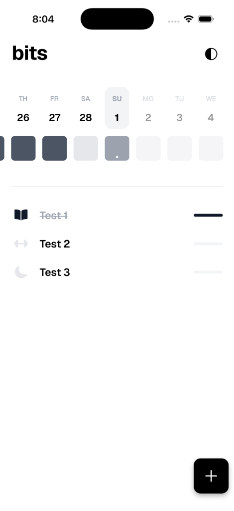
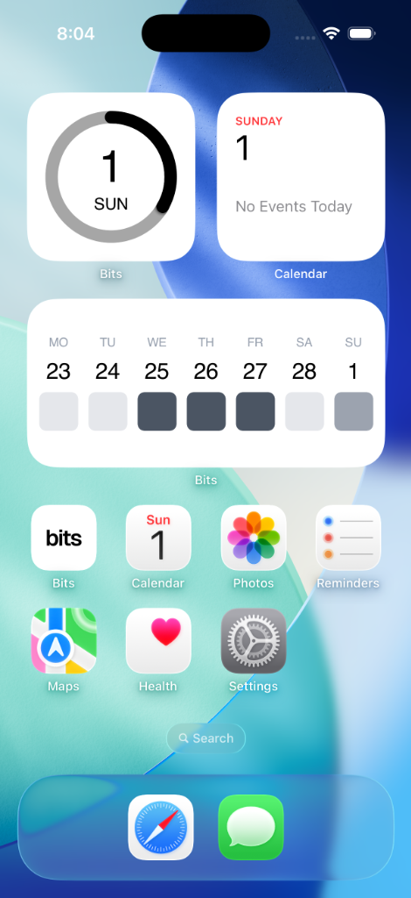

# bits

**Bits** is a beautifully designed, minimalist habit tracking application built with Expo and React Native. It focuses on simplicity and native integration, helping you build consistency with ease.

<div align="center">
  
  
</div>

## ✨ Features

- **Daily Progress**: Visual circular gauge tracking your today's completion percentage.
- **Weekly Heatmap**: A clean 7-day visualization of your habit consistency.
- **Home Screen Widgets**: Native iOS & Android widgets to keep your habits visible:
  - **Today's Progress**: A small gauge for quick checks.
  - **Weekly Heatmap**: A medium-sized overview of your week.
- **Theme Support**: Fully responsive design that respects system light and dark modes.
- **Modern Typography**: Powered by the Geist Sans font family for a premium feel.
- **Persistent Storage**: Robust local data management using **Expo SQLite** and **Drizzle ORM**.

## 🛠️ Tech Stack

- **Core**: Expo (v55+), React Native (0.83+)
- **Navigation**: Expo Router (File-based)
- **Database**: Drizzle ORM + Expo SQLite
- **Widgets**: Native SwiftUI (iOS) & Native Android Widgets
- **Styling**: Vanilla React Native Styles with Dark Mode support
- **Font**: Geist Sans

## 🚀 Getting Started

### Prerequisites

- [Node.js](https://nodejs.org/) (LTS)
- [pnpm](https://pnpm.io/)
- [Expo CLI](https://docs.expo.dev/get-started/installation/)
- **For iOS Widgets**: macOS with Xcode installed

### Installation

1. Clone the repository:

   ```bash
   git clone https://github.com/shamilkotta/bits.git
   cd bits
   ```

2. Install dependencies:

   ```bash
   pnpm install
   ```

3. Initialize the database:
   ```bash
   pnpm db:push
   ```

### Running the App

- **Standard Start**:

  ```bash
  pnpm start
  ```

- **iOS (with Widgets Support)**:

  ```bash
  pnpm ios
  ```

- **Android**:
  ```bash
  pnpm android
  ```

## 📱 Widgets

This project leverages native widget capabilities. To see the widgets on iOS, you must run the app using `pnpm ios` (which builds the native code) and then add the widgets from the Home Screen menu.

## 📄 License

This project is private and intended for personal use.
